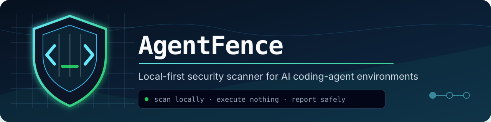
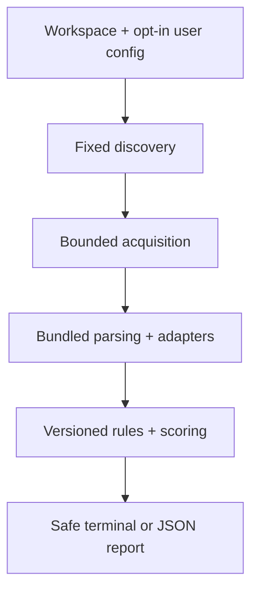

<p align="center">
  
</p>

<h1 align="center">AgentFence</h1>

<p align="center">
  <strong>Audit AI coding-agent configuration before it becomes an attack surface.</strong><br>
  A local-first, non-executing static scanner for agent instructions, MCP configuration, hooks, permissions, and exposed capabilities.
</p>

<p align="center">
  <a href="https://www.npmjs.com/package/@adulph3/agentfence"></a>
  <a href="https://github.com/Adulph3/AgentFence/actions/workflows/ci.yml"></a>
  <a href="https://github.com/Adulph3/AgentFence/releases/latest"></a>
  <a href="https://nodejs.org/"></a>
  <a href="LICENSE"></a>
</p>

<p align="center">
  <a href="#quick-start"><strong>Quick start</strong></a>
  · <a href="#what-it-checks">Checks</a>
  · <a href="#supported-ecosystem">Adapters</a>
  · <a href="#security-model">Security model</a>
  · <a href="#cli-reference">CLI</a>
</p>

```bash
npx @adulph3/agentfence@0.2.0 scan .
npx @adulph3/agentfence@0.2.0 doctor
```

No global installation is required. AgentFence v0.2.0 supports Node.js 22 and 24; Node.js 24 is recommended.

> [!IMPORTANT]
> The official npm package is **`@adulph3/agentfence`**. The unscoped package `agentfence` is unrelated to this project.

## Why AgentFence?

AI coding tools can consume instructions and configuration that grant or request meaningful local capabilities: shell hooks, MCP servers, environment references, filesystem roots, approval modes, and project-level instructions. Reviewing each vendor format by hand is easy to skip and hard to compare.

AgentFence provides one conservative, deterministic view of the supported files that are present. It answers:

- Which agent configuration surfaces were found?
- What capability or risky behavior is declared?
- Which findings deserve review first?
- Was the scan complete, partial, or unable to assess supported input?
- How did each finding affect the observed-risk score?

AgentFence reports declarations and requests. It does not claim that a configuration is malicious, reachable, exploitable, or active at runtime.

## What it checks

| Area | Examples of observable risk |
| --- | --- |
| Secrets | Credential-bearing environment bindings and non-empty literals in recognized sensitive fields |
| Shell | Shell wrappers, elevation, recursive deletion, command composition, and Git push automation |
| Supply chain | Mutable or temporary npm package runners and download-to-interpreter flows |
| MCP | Local process servers, remote endpoints, transport, launcher, enablement, and dynamic construction |
| Network | Plain HTTP MCP endpoints outside literal loopback addresses |
| Filesystem | Broad roots passed through recognized filesystem-server schemas |
| Permissions | Documented approval-bypass or broad auto-approval settings |
| Instructions | Affirmative requests for credential access, safeguard bypass, data transmission, or risky automation |
| Unicode | Bidirectional controls and unusual hidden format/control characters |
| Capability combinations | Shell, network, and sensitive-environment capabilities declared for the same principal |

The executable catalog currently contains 23 versioned rules. See [detector coverage](docs/DETECTORS.md) for rule IDs, confidence boundaries, and intentional exclusions.

## Supported ecosystem

These are configuration adapters, not vendor partnerships or endorsements.

| Adapter | Recognized project surfaces |
| --- | --- |
| Codex | `.codex/config.toml`, `AGENTS.md`, `AGENTS.override.md` |
| Claude Code | `.claude/settings.json`, `.claude/settings.local.json`, `CLAUDE*.md`, `.claude/rules/*.md`, supported MCP and hook structures |
| Cursor | `.cursor/mcp.json`, `.cursor/hooks.json`, `.cursor/rules/*.mdc`, legacy `.cursorrules` |
| Kiro | `.kiro/settings/mcp.json`, `.kiro/hooks/*.json`, `.kiro/steering/*.md` |
| VS Code | `.vscode/mcp.json`, `.vscode/settings.json` |
| Generic MCP | Recognized `.mcp.json` transport, command/argv, URL, and environment fields |

Support is intentionally narrow and versioned. Unknown security-relevant syntax becomes a coverage limitation instead of being assigned guessed semantics. `--user-configs` adds a fixed allowlist of supported Codex, Claude Code, Cursor, and Kiro locations; it does not crawl the home directory. See the [compatibility matrix](docs/COMPATIBILITY.md).

## Security model

Scanned content is hostile data, never authority.

| Boundary | AgentFence behavior |
| --- | --- |
| Execution | Does not launch agents, hooks, commands, packages, or MCP servers |
| Network | `scan` and `doctor` make no application-initiated network requests, endpoint probes, uploads, or update checks |
| Privacy | No telemetry, analytics, backend, cloud account, or remote AI |
| Filesystem | Uses bounded discovery and reads; links, non-regular files, and observed containment failures are rejected |
| Output | Omits raw values, commands, URLs, headers, parser errors, secret-derived hashes, and raw paths |
| Writes | Read-only by default; `--output` exclusively creates a new report and never overwrites an existing file |
| Uncertainty | Malformed, unreadable, oversized, changing, or unsupported inputs make coverage partial rather than falsely clean |



Raw bytes still exist briefly in process memory, and portable Node.js filesystem checks cannot prove containment against a concurrently hostile tree. For adversarial repositories, use an externally prepared immutable local snapshot. Read the complete [threat model](docs/THREAT_MODEL.md) and [privacy model](docs/PRIVACY.md).

## Quick start

### Requirements

- Node.js 22 or 24
- A local directory to inspect

Scan the current directory without installing AgentFence globally:

```bash
npx @adulph3/agentfence@0.2.0 scan .
```

Run the fixed-surface runtime and safety self-check:

```bash
npx @adulph3/agentfence@0.2.0 doctor
```

`npx` may contact the npm registry to obtain the package. Once running, AgentFence's `scan` and `doctor` commands do not initiate application network activity.

## Common workflows

### Scan another project

```bash
npx @adulph3/agentfence@0.2.0 scan ../another-project
```

### Include supported user-level configuration

```bash
npx @adulph3/agentfence@0.2.0 scan . --user-configs
```

### Show only High and Critical findings

```bash
npx @adulph3/agentfence@0.2.0 scan . --severity high
```

### Produce JSON for CI or other tooling

```bash
npx @adulph3/agentfence@0.2.0 scan . --json --fail-on high > agentfence-report.json
```

### Create a report without overwriting an existing file

```bash
npx @adulph3/agentfence@0.2.0 scan . --output agentfence-report.json
```

Reports are security artifacts even though raw paths and secret values are omitted. Store and share them accordingly.

## Understanding the report

| Report element | Meaning |
| --- | --- |
| Coverage | How many eligible sources were analyzed and whether any input was skipped or unsupported |
| Agents | Configuration ecosystems inferred from supported evidence; not proof that a tool is installed or active |
| Findings | Versioned rule matches with severity, confidence, applicability, safe location, and remediation |
| Score | `100 - capped deductions` under scoring model `1.0.0`; a summary of observed configuration risk |
| Highest severity | The most severe finding, shown separately because one severe issue can coexist with a moderate score |
| Errors | Fixed safe codes describing partial or fatal coverage without echoing raw parser/OS errors |

A score of 100 means no negative finding was observed in successfully assessed supported input. It does **not** certify the repository, agent, or machine as secure. A partial scan has a provisional score, and a scan with no supported input has no score.

See [scoring](docs/SCORING.md) for weights, caps, grouping, and worked examples. JSON output conforms to the bundled schemas in [`schemas/`](schemas/).

## CLI reference

### Commands

| Command | Purpose |
| --- | --- |
| `agentfence scan [PATH]` | Scan a local directory; `PATH` defaults to the current directory |
| `agentfence doctor [--json]` | Check runtime support, adapter metadata, and in-memory safety self-tests |
| `agentfence --help` | Print usage without scanning |
| `agentfence --version` | Print the installed version without scanning |

### Scan options

| Option | Behavior |
| --- | --- |
| `--json` | Emit the complete safe JSON report to stdout |
| `--output PATH` | Create a new JSON report; an existing destination is never overwritten |
| `--severity LEVEL` | Filter terminal display: `info`, `low`, `medium`, `high`, or `critical` |
| `--fail-on LEVEL` | Set the exit threshold: `none`, `info`, `low`, `medium`, `high`, or `critical` |
| `--user-configs` | Add the fixed allowlist of supported user-level configuration |
| `--no-color` | Disable color; a non-empty `NO_COLOR` is also honored |
| `--` | End option parsing so a path beginning with `-` can be supplied |

`--severity` affects terminal presentation only; it never removes JSON findings or changes the score. The default failure threshold is `high`. `--fail-on none` disables finding-threshold failure, but partial, fatal, output, and interruption exits still apply.

### Exit codes

| Code | Meaning |
| ---: | --- |
| `0` | Complete scan below the threshold, or successful help/version/doctor |
| `1` | Complete scan with an applicable finding at or above `--fail-on` |
| `2` | Invalid invocation/root, unsupported runtime, internal fatal error, or output failure |
| `3` | Partial coverage; known findings remain useful, but the score is provisional |
| `130` | User interruption, unless an output failure takes precedence |

Precedence is `2` → `130` → `3` → `1` → `0`. CI should treat exit `3` as an incomplete assessment that requires review, not as a clean result.

## Installation options

### One-off, version-pinned

```bash
npx @adulph3/agentfence@0.2.0 scan .
```

### Project development dependency

```bash
npm install --save-dev --save-exact @adulph3/agentfence@0.2.0
npx agentfence scan .
```

### Global CLI

```bash
npm install --global @adulph3/agentfence@0.2.0
agentfence scan .
```

For reproducible security tooling, prefer an exact version. Confirm the package name includes the `@adulph3/` scope before installation.

## How it works

1. **Discovery** matches a fixed registry of supported project files and any explicitly enabled user allowlist.
2. **Acquisition** applies traversal, byte, entry, depth, link, device, and containment limits.
3. **Parsing** uses fixed bundled JSON, JSONC, TOML, and Markdown-aware workers; scanned content cannot select code to load.
4. **Normalization** maps vendor-specific structures to typed facts without preserving raw secret-bearing values.
5. **Analysis** applies a compiled, versioned rule catalog without executing or resolving external state.
6. **Scoring** groups duplicate risk, applies confidence weights and category caps, and marks incomplete scores provisional.
7. **Reporting** emits stable safe DTOs as terminal text or schema-validated JSON.

```text
src/cli          command and exit behavior
src/discovery    fixed supported-file registry
src/fs           bounded local acquisition and exclusive output
src/parsers      guarded JSON/JSONC/TOML/Markdown parsing
src/adapters     Codex, Claude Code, Cursor, Kiro, VS Code, MCP
src/analysis     normalized shell, environment, path, instruction facts
src/rules        compiled detector registry
src/scoring      deterministic observed-risk model
src/reporters    safe terminal and JSON output
schemas          versioned machine-readable contracts
```

For dependency direction, raw/safe boundaries, and public APIs, read [Architecture](docs/ARCHITECTURE.md).

## Release integrity

The current stable release is [`v0.2.0`](https://github.com/Adulph3/AgentFence/releases/tag/v0.2.0), built from commit [`36d1a7f`](https://github.com/Adulph3/AgentFence/commit/36d1a7f4ad938b57f52db101ee84a77d891f489c).

| Field | Value |
| --- | --- |
| npm package | [`@adulph3/agentfence@0.2.0`](https://www.npmjs.com/package/@adulph3/agentfence/v/0.2.0) |
| GitHub artifact | [`adulph3-agentfence-0.2.0.tgz`](https://github.com/Adulph3/AgentFence/releases/download/v0.2.0/adulph3-agentfence-0.2.0.tgz) |
| Artifact SHA-256 | `ac7c7bbcedcb07b1a290229ec417a353ce006f88d1efbd81f3184ecb30bd7429` |
| Runtime | Node.js 22 or 24 |
| Hosted CI | Ubuntu, macOS, and Windows on Node.js 22 and 24 |

Verify the downloaded GitHub artifact on Linux:

```bash
printf '%s  %s\n' \
  'ac7c7bbcedcb07b1a290229ec417a353ce006f88d1efbd81f3184ecb30bd7429' \
  'adulph3-agentfence-0.2.0.tgz' | sha256sum --check
```

On macOS, use `shasum -a 256`; on Windows, use `Get-FileHash -Algorithm SHA256`. Version-specific artifacts and checksums belong on [GitHub Releases](https://github.com/Adulph3/AgentFence/releases).

## Development

```bash
git clone https://github.com/Adulph3/AgentFence.git
cd AgentFence
npm ci --ignore-scripts
npm run typecheck
npm run lint
npm test
npm run test:coverage
npm run build
```

Node.js 22 and 24 are supported. Use synthetic offline fixtures only. Changes to rules, adapters, dependencies, public schemas, or output safety require the focused checks described in [CONTRIBUTING.md](CONTRIBUTING.md).

## Limitations

AgentFence is static analysis, not runtime enforcement. It does not:

- prove that an agent, repository, endpoint, package, or machine is secure;
- observe live permissions, trust prompts, processes, or MCP tool descriptions;
- validate credentials or read their environment values;
- resolve DNS, test endpoint reachability, query CVEs, or verify package provenance;
- fully interpret arbitrary shell languages or execute referenced hook scripts;
- scan Git history, arbitrary application source code, or an entire home directory;
- guarantee complete containment while another process mutates the scanned filesystem; or
- guarantee memory zeroization for bytes handled by JavaScript.

English instruction heuristics can miss multilingual, encoded, indirect, quoted, fenced, or otherwise obfuscated requests. Unsupported formats and incomplete context remain explicit coverage limits.

## FAQ

<details>
<summary><strong>Does AgentFence modify my agent configuration?</strong></summary>

No. Scans are read-only. Only `--output` writes, and it exclusively creates a new report file.

</details>

<details>
<summary><strong>Does it execute instructions, hooks, or MCP servers?</strong></summary>

No. Those values are classified as hostile data and are never executed by the scanner.

</details>

<details>
<summary><strong>Does it upload my configuration?</strong></summary>

No. `scan` and `doctor` have no application backend, telemetry, remote AI, or application-initiated network requests.

</details>

<details>
<summary><strong>Does zero findings mean the system is secure?</strong></summary>

No. It means no finding was produced for successfully assessed supported input under the current rule set. Runtime behavior and unsupported surfaces remain outside that conclusion.

</details>

<details>
<summary><strong>Can it run in CI?</strong></summary>

Yes. Use `--fail-on` for a finding threshold, JSON for automation, and handle partial exit code `3` explicitly.

</details>

<details>
<summary><strong>Why is the npm package scoped?</strong></summary>

The unscoped npm name is owned by a different project. This repository publishes only as `@adulph3/agentfence`; the executable remains `agentfence` after installation.

</details>

## Security and contributing

Do not paste credentials, private configuration, raw reports, private paths, or unfixed exploit details into public issues. Report vulnerabilities through [GitHub private vulnerability reporting](https://github.com/Adulph3/AgentFence/security/advisories/new) and read [SECURITY.md](SECURITY.md).

Bug reports and focused pull requests are welcome. Start with [CONTRIBUTING.md](CONTRIBUTING.md) and preserve the project's no-execution, zero-runtime-network, read-only-default, deterministic, and safe-output invariants.

## License

AgentFence is available under the [MIT License](LICENSE). Runtime dependency notices are in [THIRD_PARTY_NOTICES.md](THIRD_PARTY_NOTICES.md).
