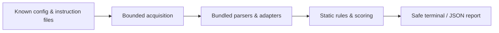

<p align="center">
  
</p>

<h1 align="center">AgentFence</h1>

<p align="center">
  <strong>Local-first security scanner for AI coding-agent environments.</strong><br>
  Audit supported configuration and instruction files without executing the content you scan.
</p>

<p align="center">
  <a href="https://github.com/Adulph3/AgentFence/actions/workflows/ci.yml"></a>
  <a href="https://github.com/Adulph3/AgentFence/releases/latest"></a>
  <a href="https://nodejs.org/"></a>
  <a href="#installation"></a>
  <a href="LICENSE"></a>
</p>

<p align="center">
  <a href="#quick-start"><strong>Quick Start</strong></a>
  · <a href="#installation">Installation</a>
  · <a href="#usage-examples">Usage examples</a>
  · <a href="#security-model">Security</a>
</p>

> [!IMPORTANT]
> AgentFence reports observable configuration exposure. It is not a sandbox, a runtime monitor, or a guarantee that an agent, repository, or machine is secure.

## What is AgentFence?

AgentFence is an offline static audit for supported AI coding-agent configuration and instruction files. It identifies review-worthy declarations—such as hooks, shell commands, MCP servers, credential-bearing environment references, broad filesystem roots, and unsafe instruction patterns—before you trust or run the surrounding tooling.

The scanner uses fixed local discovery, bundled parsers, deterministic rules, and safe terminal or JSON reports. It does not start an agent, execute a hook, launch an MCP server, install a package, resolve a remote endpoint, or send scan data anywhere.

## Why AgentFence?

AI coding agents can read project instructions, load MCP configuration, inherit local capabilities, and invoke lifecycle hooks. Those configuration surfaces are useful, but they can be difficult to review across tools and scopes.

AgentFence gives developers one conservative view of the supported configuration that is present:

- what agent ecosystem was detected;
- which declared capabilities deserve review;
- where the evidence exists through opaque source identifiers;
- how findings affect an explainable score; and
- whether coverage was complete, partial, or blocked.

It describes declarations and requests—not intent, exploitability, live permissions, or compromise.

## Key features

| Capability | What AgentFence provides |
| --- | --- |
| Cross-agent inspection | Fixed adapters for Codex, Claude Code, Cursor, Kiro, VS Code, and generic MCP configuration |
| MCP analysis | Transport, launcher, package selector, environment binding, enabled-state, endpoint-class, and recognized filesystem-root observations |
| Shell and supply-chain findings | Shell wrappers, elevation, recursive deletion, command composition, Git push automation, mutable package runners, and downloader-to-interpreter flows |
| Secret-safe environment analysis | Detects curated credential-bearing names and literal credential configuration without emitting secret values |
| Instruction and Unicode checks | Conservative instruction heuristics plus bidi and unusual control/format code-point detection |
| Filesystem safety | Bounded discovery and reads, containment checks, no-follow link handling, and explicit partial-coverage reporting |
| Deterministic results | Versioned rules and scoring with stable terminal and JSON output for identical complete inputs |
| Local operation | No application-initiated network requests, telemetry, analytics, backend, remote AI, or live MCP access during `scan` or `doctor` |
| Automation support | Safe JSON reports, threshold-based exits, severity filtering, and a fixed-surface `doctor` command |

See [detector coverage](docs/DETECTORS.md), [scoring](docs/SCORING.md), and the [threat model](docs/THREAT_MODEL.md) for the precise contracts.

## Supported ecosystems

| Ecosystem | Recognized configuration and instruction surfaces | Status |
| --- | --- | :---: |
| OpenAI Codex | `.codex/config.toml`, `AGENTS.md`, `AGENTS.override.md` | Supported |
| Claude Code | `.claude/settings.json`, `.claude/settings.local.json`, `CLAUDE*.md`, `.claude/rules/*.md`, documented MCP and nested hook structures | Supported |
| Cursor | `.cursor/mcp.json`, `.cursor/hooks.json`, `.cursor/rules/*.mdc`, legacy `.cursorrules` | Supported |
| Kiro | `.kiro/settings/mcp.json`, `.kiro/hooks/*.json`, `.kiro/steering/*.md` | Supported |
| VS Code | `.vscode/mcp.json`, `.vscode/settings.json` | Supported |
| Generic MCP | `.mcp.json` universal transport, command/argv, URL, and environment semantics | Supported |

Support is intentionally narrow and versioned. Unknown security-relevant syntax becomes a coverage limitation rather than guessed semantics. User-level configuration is opt-in through `--user-configs` and a fixed allowlist; AgentFence never crawls an entire home directory. See the full [compatibility matrix](docs/COMPATIBILITY.md).

## Security model

AgentFence treats repository files, configuration, instructions, hooks, commands, URLs, names, links, and parser failures as hostile data.

| Guarantee | Behavior |
| --- | --- |
| No scanned-content execution | No agent, hook, command, package, or MCP server is launched |
| No application network activity | `scan` and `doctor` do not initiate runtime network requests, update checks, uploads, or endpoint probes |
| No telemetry | No analytics, backend, cloud account, remote AI, or usage collection |
| Read-only by default | The scan reads bounded supported inputs; only explicit `--output` creates a new report file and it never overwrites an existing destination |
| Secret-safe reporting | Reports omit raw paths, names, values, URLs, commands, headers, parser errors, and secret-derived hashes |
| Explicit uncertainty | Unreadable, malformed, oversized, changing, or unsupported inputs produce partial coverage instead of a false clean result |



**No execution · No application-initiated network requests · No telemetry**

Raw source bytes still exist in process memory while being analyzed, and portable Node.js checks cannot prove containment against a concurrently hostile filesystem. For adversarial trees, scan an externally prepared immutable local snapshot. Read the complete [privacy model](docs/PRIVACY.md) and [threat model](docs/THREAT_MODEL.md).

## Quick Start

AgentFence v0.2.0 supports Node.js 22 and 24; Node.js 24 is recommended. Untested odd-numbered releases are not supported. Once the scoped package is published, use it for a one-off scan without a permanent installation:

```bash
npx @adulph3/agentfence scan
npx @adulph3/agentfence scan --user-configs
```

The optional permanent installation keeps the executable name `agentfence`:

```bash
npm install -g @adulph3/agentfence
agentfence scan
agentfence scan --user-configs
```

For an explicit package selection, `npx --package=@adulph3/agentfence agentfence scan` is equivalent. Verify the scoped package's publication before using these registry-backed commands. The unrelated unscoped npm package `agentfence` is **not this project**. npm/npx installation may contact the registry; AgentFence's `scan` and `doctor` commands make no application-initiated network requests.

## Installation

The platform-specific steps below remain available for the separately verified v0.1.0 GitHub artifact. For v0.2.0, use the scoped npm commands in [Quick Start](#quick-start) after confirming publication.

AgentFence v0.1.0 requires **Node.js 24.x** (`>=24 <25`). It is distributed through GitHub Releases and is **not published to the npm registry**. The commands below install the downloaded local `.tgz` artifact.

Official artifact: [`agentfence-0.1.0.tgz`](https://github.com/Adulph3/AgentFence/releases/download/v0.1.0/agentfence-0.1.0.tgz)

SHA-256:

```text
4d5271aad1a7f56f66555752d6a3184643cac0213a712079af33d95709db278b
```

<details open>
<summary><strong>Linux</strong></summary>

1. Install Node.js 24 using your preferred version manager or the [official Node.js download](https://nodejs.org/en/download), then verify the runtime:

   ```bash
   node --version
   npm --version
   ```

   `node --version` must report `v24.x.x`.

2. Download the official release artifact:

   ```bash
   curl -fLO https://github.com/Adulph3/AgentFence/releases/download/v0.1.0/agentfence-0.1.0.tgz
   ```

3. Verify the checksum:

   ```bash
   printf '%s  %s\n' \
     '4d5271aad1a7f56f66555752d6a3184643cac0213a712079af33d95709db278b' \
     'agentfence-0.1.0.tgz' | sha256sum --check
   ```

4. Install the local package and verify it:

   ```bash
   npm install -g ./agentfence-0.1.0.tgz
   agentfence --version
   agentfence doctor
   ```

</details>

<details>
<summary><strong>macOS</strong></summary>

1. Install Node.js 24 using your preferred version manager or the [official Node.js download](https://nodejs.org/en/download), then verify the runtime:

   ```bash
   node --version
   npm --version
   ```

   `node --version` must report `v24.x.x`.

2. Download the official release artifact:

   ```bash
   curl -fLO https://github.com/Adulph3/AgentFence/releases/download/v0.1.0/agentfence-0.1.0.tgz
   ```

3. Verify the checksum:

   ```bash
   expected='4d5271aad1a7f56f66555752d6a3184643cac0213a712079af33d95709db278b'
   actual="$(shasum -a 256 agentfence-0.1.0.tgz | awk '{print $1}')"
   [ "$actual" = "$expected" ] || { echo 'Checksum mismatch' >&2; exit 1; }
   ```

4. Install the local package and verify it:

   ```bash
   npm install -g ./agentfence-0.1.0.tgz
   agentfence --version
   agentfence doctor
   ```

</details>

<details>
<summary><strong>Windows (PowerShell)</strong></summary>

1. Install Node.js 24 from the [official Node.js download](https://nodejs.org/en/download). Open a new PowerShell window and verify the runtime:

   ```powershell
   node --version
   npm --version
   ```

   `node --version` must report `v24.x.x`.

2. Download the official release artifact:

   ```powershell
   Invoke-WebRequest `
     -Uri "https://github.com/Adulph3/AgentFence/releases/download/v0.1.0/agentfence-0.1.0.tgz" `
     -OutFile "agentfence-0.1.0.tgz"
   ```

3. Verify the checksum:

   ```powershell
   $expected = "4D5271AAD1A7F56F66555752D6A3184643CAC0213A712079AF33D95709DB278B"
   $actual = (Get-FileHash .\agentfence-0.1.0.tgz -Algorithm SHA256).Hash
   if ($actual -ne $expected) { throw "AgentFence checksum mismatch" }
   ```

4. Install the local package and verify it:

   ```powershell
   npm install -g .\agentfence-0.1.0.tgz
   agentfence --version
   agentfence doctor
   ```

   On Windows, `--output` files use the inherited ACL of the selected parent directory; operators must choose a suitably restricted parent directory. Mocked and lexical Windows tests do not validate real inherited-ACL confidentiality.

</details>

On POSIX systems, `--output` creates a new report with mode `0600`. On Windows, report confidentiality depends on the inherited ACL of the selected parent directory, which the operator must restrict appropriately; mocked or lexical Windows tests do not establish real ACL behavior.

## Usage examples

Run AgentFence from the project you want to inspect:

```bash
agentfence scan .
```

Common workflows:

```bash
# Safe JSON on stdout
agentfence scan . --json

# Create a new JSON report; existing files are never overwritten
agentfence scan . --output report.json

# Opt into the fixed allowlist of supported user configuration
agentfence scan . --user-configs
# Show High/Critical findings and fail when either is present
agentfence scan . --severity high --fail-on high

# Run fixed-surface runtime and self-test diagnostics
agentfence doctor
agentfence doctor --json
```

The default failure threshold is `high`. A complete scan exits `1` when an applicable High or Critical finding reaches that threshold.

## CLI reference

### Commands

| Command | Purpose |
| --- | --- |
| `agentfence scan [PATH]` | Scan a local directory; `PATH` defaults to the invocation directory |
| `agentfence doctor` | Check Node.js support, fixed adapter metadata, and in-memory safety self-tests |
| `agentfence --help` | Print command usage without scanning |
| `agentfence --version` | Print the installed version without scanning |

### Scan options

| Option | Behavior |
| --- | --- |
| `--json` | Write the complete safe JSON report to stdout |
| `--output PATH` | Create a new JSON report file; never overwrite an existing destination |
| `--severity LEVEL` | Filter terminal presentation only; one of `info`, `low`, `medium`, `high`, `critical` |
| `--fail-on LEVEL` | Set the exit threshold; one of `none`, `info`, `low`, `medium`, `high`, `critical` |
| `--user-configs` | Add the fixed allowlist of supported user-level configuration |
| `--no-color` | Disable terminal color; non-empty `NO_COLOR` is also honored |
| `--` | End option parsing so a path beginning with `-` can be supplied |

`--severity` never removes findings from JSON and never changes the score. `--fail-on none` disables finding-threshold failures, but partial, fatal, output, and interruption exits still take precedence. `--json --output PATH` is valid and writes only the file.

## Exit codes

| Code | Meaning |
| ---: | --- |
| `0` | Complete scan below the configured threshold, or successful help/version/doctor |
| `1` | Complete scan with an applicable finding at or above `--fail-on` |
| `2` | Invalid invocation/root, unsupported runtime, internal fatal error, or output failure |
| `3` | Partial coverage; findings remain useful, but the score is provisional |
| `130` | User interruption, unless an output failure takes precedence |

Precedence is `2` → `130` → `3` → `1` → `0`. A partial result does not conceal known findings or become successful under `--fail-on none`.

## CI and automation

Install the verified release artifact in your job, then use AgentFence as a threshold gate:

```bash
agentfence scan . --fail-on high
```

For machine-readable evidence:

```bash
agentfence scan . --json --fail-on high > agentfence-report.json
```

Treat exit `1` as a configured policy threshold, exit `3` as incomplete coverage requiring review, and exit `2` as a scanner/runtime failure. Reports can contain sensitive configuration observations even though secret values and raw paths are omitted; handle them as security artifacts.

The AgentFence repository's workflow is configured to run the complete quality-gate sequence on Ubuntu, macOS, and Windows with Node.js 22.23.2 and 24.21.0.

## How AgentFence works

1. **Discovery** — match only the fixed registry of supported project files and any explicitly enabled user allowlist.
2. **Bounded acquisition** — enforce traversal, entry, file-size, total-byte, link, device, and containment checks.
3. **Isolated parsing** — send bounded bytes to fixed bundled parser/analysis workers; raw buffers and syntax trees do not return to reporters.
4. **Vendor normalization** — project documented Codex, Claude Code, Cursor, Kiro, VS Code, and MCP structures into typed facts.
5. **Static analysis** — apply the versioned rule catalog without executing commands or resolving external state.
6. **Deterministic scoring** — group and cap deductions under scoring model `1.0.0`; partial scores are marked provisional.
7. **Safe reporting** — emit escaped terminal text or schema-validated JSON containing only safe projections.

For implementation boundaries and public APIs, see [Architecture](docs/ARCHITECTURE.md).

## Release integrity

| Field | Verified value |
| --- | --- |
| Release | [`v0.1.0`](https://github.com/Adulph3/AgentFence/releases/tag/v0.1.0) |
| Artifact | [`agentfence-0.1.0.tgz`](https://github.com/Adulph3/AgentFence/releases/download/v0.1.0/agentfence-0.1.0.tgz) |
| SHA-256 | `4d5271aad1a7f56f66555752d6a3184643cac0213a712079af33d95709db278b` |
| Required runtime | Node.js `>=24 <25` |
| Distribution | GitHub Releases only; not the npm registry |

Always verify the checksum before installing. The release artifact and its digest are also recorded on the [v0.1.0 release page](https://github.com/Adulph3/AgentFence/releases/tag/v0.1.0).

## Project status

| Check | Status |
| --- | --- |
| Previously verified GitHub release | v0.1.0 |
| Ubuntu / Node.js 24 CI | Passed |
| macOS / Node.js 24 CI | Passed |
| Windows / Node.js 24 CI | Passed |
| CodeQL default setup | [Passed](https://github.com/Adulph3/AgentFence/actions/runs/34972625363) |
| Private vulnerability reporting | [Available](https://github.com/Adulph3/AgentFence/security/advisories/new) |

The platform statuses above refer to the repository's verified Node.js 24 quality-gate run. They do not establish Windows inherited-ACL confidentiality for arbitrary operator-selected output directories.

## Limitations

AgentFence is deliberately static and narrow. It does not:

- prove that a configuration is safe, malicious, reachable, or exploitable;
- monitor an agent after the scan;
- inspect live agent permissions, trust prompts, processes, or MCP tool descriptions;
- validate credentials, resolve environment values, query package provenance, or perform CVE lookup;
- execute arbitrary hook scripts or fully interpret shell grammar;
- scan Git history, arbitrary source code, an entire home directory, or unknown vendor formats;
- fully contain a filesystem that another process is changing during the scan; or
- guarantee memory zeroization for hostile bytes handled by JavaScript.

Version pinning reduces selector drift but does not prove package integrity. Instruction heuristics are conservative and can miss multilingual, encoded, indirect, quoted, fenced, or negated requests. Unknown or unsupported security-relevant structures are reported as coverage limitations where possible.

## Updating and uninstalling

For the scoped npm package, update or uninstall with:

```bash
npm install -g @adulph3/agentfence@latest
npm uninstall -g @adulph3/agentfence
```

For a GitHub Release artifact, download its `.tgz`, verify the published checksum, and install the local file:

```bash
npm install -g ./agentfence-VERSION.tgz
```

## Security reporting

Do not post credentials, raw reports, private paths, or exploit payloads in public issues. Report suspected vulnerabilities through [GitHub private vulnerability reporting](https://github.com/Adulph3/AgentFence/security/advisories/new) and include only the minimum synthetic reproduction required.

See [SECURITY.md](SECURITY.md) for the supported scope and disclosure guidance.

## Contributing

Contributions must preserve the no-execution, no-application-network, read-only-default, deterministic, and safe-output invariants. Use only synthetic offline fixtures, review every dependency, and run the documented quality gates before opening a pull request.

Read [CONTRIBUTING.md](CONTRIBUTING.md) before changing rules, adapters, dependencies, or public report behavior.

## License

AgentFence is released under the [MIT License](LICENSE).
